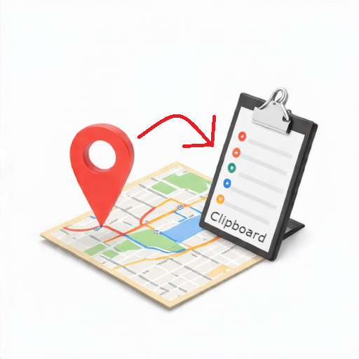

# LocationClipboard 📍📋

[English](./README.md) | 中文

**LocationClipboard** 是一个实用模组, 可以轻松地将您当前的坐标或最近记录的几次坐标复制到剪贴板

## 功能 ✨

- **📍 记录当前位置**: 通过自定义快捷键, 一键复制您当前所在位置
- **📝 多次记录位置**: 使用一个快捷键开始记录, 用另一个快捷键记录多个位置, 结束时将所有坐标 (按指定分隔符) 合并并一次性复制
- **⏱️ 自动记录位置**: 在开启多次记录后, 模组可按固定时间间隔自动记录您的位置, 停止时, 所有自动记录的坐标将被合并

## 特色 🌟

- **🎛️ 高度可定制**: 自由调整复制格式, 数值的小数点精度以及提示信息
- **🖱️ 简单易用**: 完全通过快捷键操作, 并借助 **Cloth Config API** 提供的精美配置界面进行设置, 无需使用任何指令
- **🔄 版本支持广泛**: 兼容 **Fabric 1.16+** 版本

## 使用方法 🛠️

在使用本模组前, 请确保您的游戏环境满足以下条件: 

- **Minecraft (Java) 1.16 或更高版本**
- **Fabric Loader 0.14.7 或更高版本**

必需的依赖模组: 

- **Fabric API** (任意版本)
- **Cloth Config API 4.9+**
- **ModMenu** (任意版本)

然后, 安装 **LocationClipboard** 模组本体, 通过 ModMenu 的设置按钮进入配置界面, 在控制设置中设置好您喜欢的快捷键进入世界后, 即可开始使用！

## 协议 📄

本模组基于 **LGPL-3.0** 开源协议发布  
最终解释权归 ***NeoVoxelDev 开发团队*** 所有